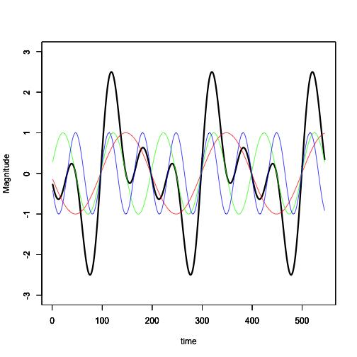

Constructive and Destructive Interference: A Learning application
========================================================
author: Steve Petersen
date: July 20, 2015

Overview
========================================================

The Constructive and Destructive Interference Application is designed as an easy-to-use learning application:
- Highly Interactive
- Promotes Understanding through Visualization
- Easy to Use

Target Audience
========================================================

The target audience is first-year students interested in the following areas of study:
- Audio engineering
- Electrical engineering
- Physics

The application allows students to experiment with different values to explore constructive and destructive interference.

How To Use
========================================================

The application allows the user to visualize how waves of different frequencies combine.  The user can:

- Set one or more component frequencies to zero to turn off that component
- Set one or more component frequences from 1 to 10 to add that component's frequency to the sum.  
- Turn on the sum of the components in the graph
- Turn on or off the individual components in the graph
 

Example output
========================================================

The following shows the output of values of 1, 2, and 3 for the Red, Green and Blue components, and the sum of the outputs:

 

Students can see how complex waveforms are formed from these simple components.  Fun!

